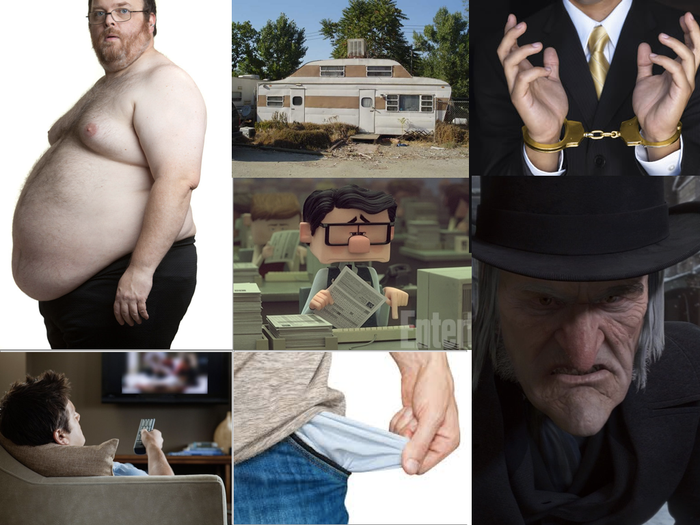

I'm sure that you have heard of Vision Boards. You know, people making a collage of images to represent what they want their lives to be like in 10 or 20 years. Here are some examples.

I've always thought that they were pretty corny. I still do.

Recently I've been making a study of _fear_.

Fear drives a lot of our actions. Incidentally, I believe that unfounded fears are the strongest chains ever crafted by man and I am on a mission to conquer mine.

However, I have discovered that you can also use fear to your advantage. You can fight fear _with fear._

Many times in life I have been afraid to take a risk because I thought that it wouldn't work out. I would then slip back comfortably back into "normal" life. Then, just the other day, I asked myself an interesting question, "What will my life look like int 10, 20, or 30 years from now if I **don't** take this chance and just keep doing what I'm doing now?"

What came to mind scared the living crap out of me. I quickly found the courage that I lacked to take a risk and am now excited to see what I can make out of it.

That question inspired the idea for what I call a "Fear Board", which has turned out to be way more effective for me than Vision Boards. First you ask yourself what you are afraid your life will be like if you continue on your current course of (in)action. Then you find images that represent your answers and make a collage. Here is mine.

Now when I feel like whining or afraid to do something, I just look at my Fear Board and Boom! Instant motivation to dive back in. I hope that you find them as powerful and helpful as I have.
