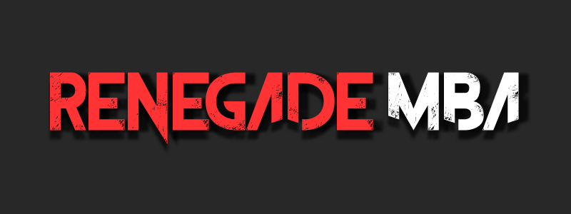

We are fed up.

We have been lied to and swindled. We want more than what the system has offered.

Traditional ways to learn business are broken. Don’t believe me? Wait until you meet your first idiot with a Wharton MBA.

**B-school doesn’t work.**

It’s inefficient and it’s outdated. Academics who have never started a business *in their life* can’t teach the next generation of entrepreneurs and revolutionaries. They focus on presentations and papers and ignore action and results.

Paying for B-school will put you in major debt to boot.

We are a community that does things differently. We read books and learn from people who have *actually done it.* We then apply what we learn and help each other along the way. At the end of the day we have real world knowledge and real world results to show for our time, not grades.

We are dropouts, misfits, rebels and hustlers. We dream and we execute. We don’t follow the crowd. We forge new paths and we build the freakin’ future.

[Join us.](http://renegademba.club)
