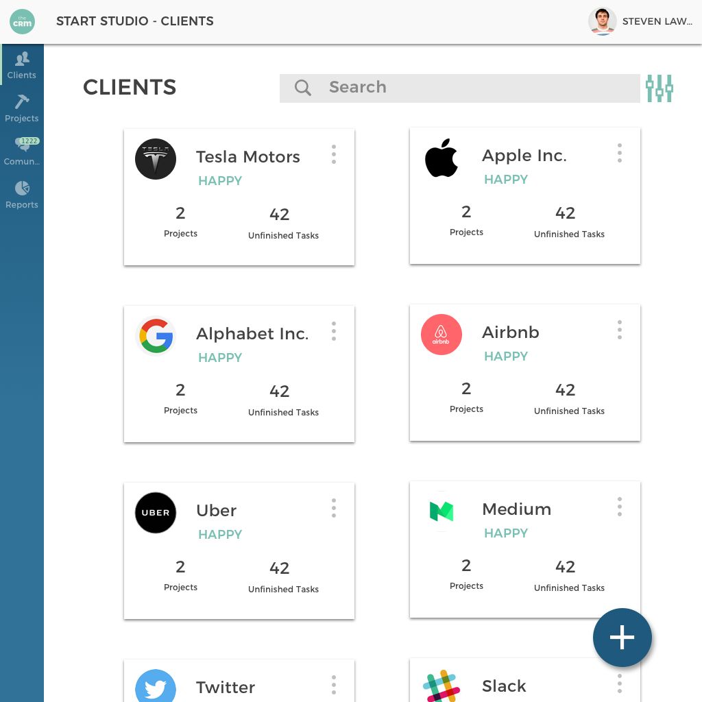

Hi, my name is Andrew Bass. I'm a UI/UX designer who has spent the last year helping over a dozen startups scope out and design their MVPs.

# What makes me different?

I believe that the best products are those that align their users needs with the business' goals. That's where the magic happens.

I believe that a product's greatness is determined just as much by what it chooses _not_ to do as by what it does. Focus is **power**.

I believe that it is better to absolutely delight a few that to try and please everybody. The few make better evangelists.

I don't believe in charging an hourly rate. You're not trying to buy my time, you're trying to buy the value that my time brings you. Let's do business accordingly.

# Sneak Peak Portfolio

# Get In touch
You can reach me via [twitter](https://www.twitter.com/andrewdbass) or via email at [andybass12@gmail.com](mailto:andybass12@gmail.com)
